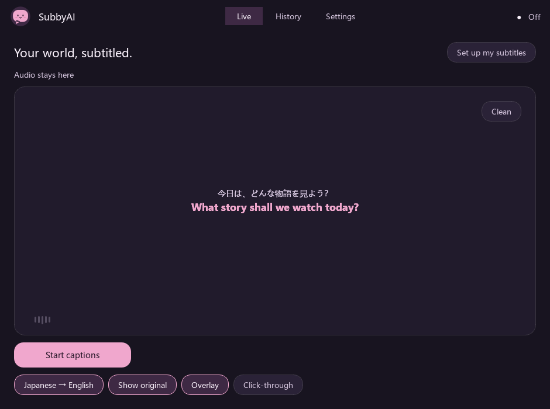
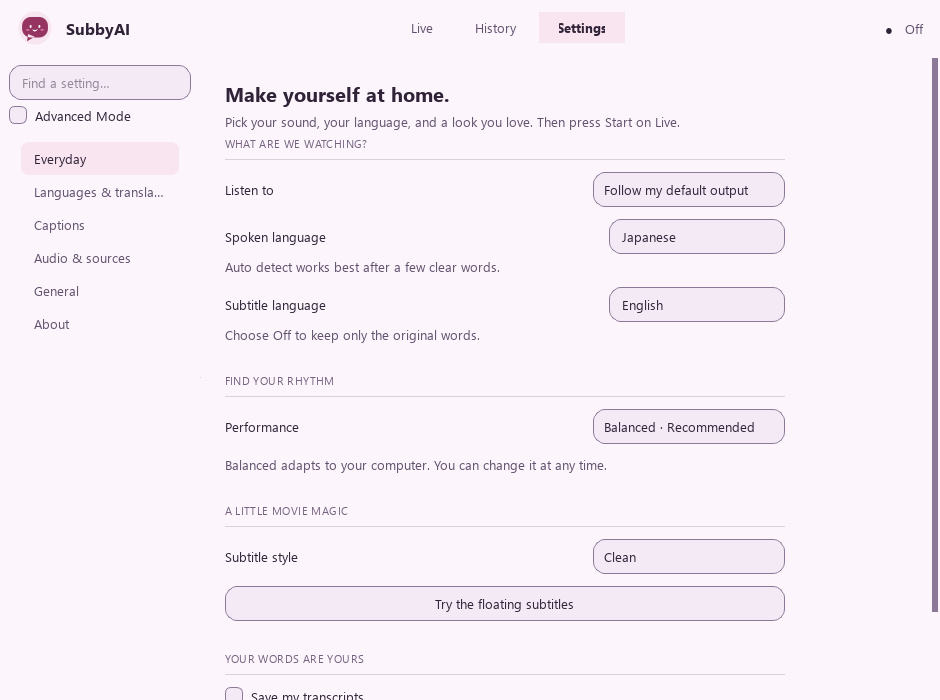

# SubbyAI

**Your world, subtitled.**

Watch anime, K-dramas, films, games and streams in the language you choose. SubbyAI
listens to your computer's audio and shows the original speech and its translation
in a customizable desktop overlay.

Local speech recognition and translation are the defaults. No account, subscription
or API key is needed for local use. Download your models once, then watch offline.

> **Status: V1 (1.0.0). Builds are unsigned.** Windows users may see
> SmartScreen and macOS users may see Gatekeeper. Read the
> [Windows](docs/installation-windows.md) or [macOS](docs/installation-macos.md) guide.
> Release artifacts are built from tags into a draft release for review.



## Start watching

1. Get the Windows installer or portable ZIP from [Releases](https://github.com/ChanJianHao/SubbyAI/releases).
2. Open SubbyAI. Setup recommends a model for your computer and lets you test the audio meter.
3. Choose your headphones or system output, the language you'll hear, and your subtitle language.
4. Pick **Fast**, **Balanced**, or **Accurate** and preview a subtitle style.
5. Press **Start**. The first speech model download shows progress and can be cancelled.
   A missing translation pack downloads when that language pair is first needed.

A quiet meter usually means the selected output isn't playing sound. Choose the device
that your video uses. Set the input language explicitly when automatic detection struggles
with short phrases or mixed-language media.

## Simple on the surface

Everyday settings put your source, languages, performance and subtitle style together.
**Balanced** is recommended for most viewing. Fast uses shorter phrases and a lighter model;
Accurate gives difficult speech more context and takes longer.



Enable **Advanced Mode** for exact engines, CPU/GPU selection, precision, phrase timing,
translation providers, a remote speech server, shortcuts and diagnostics. Turning it off
preserves all your settings. Technical changes show as **Custom** until you choose a profile.

## Made for watching

- Original speech appears first; translation attaches to the same caption when ready.
- Eight subtitle presets, including Cinema, Anime, Cute and High contrast, plus custom
  fonts, colours, outline, shadow, panel opacity, alignment, width and line limits.
- A draggable, click-through overlay with display selection and remembered placement.
- Friendly audio status, reconnect handling, cancellable model downloads and a tray menu.
- Light, dark and system themes with Sakura or Ocean accents and **Mochi**, our original
  smiling subtitle companion. No heavy web UI or constantly running animations.
- Optional searchable transcripts with TXT, SRT, VTT and Markdown export. Saving is **off
  by default**; enabling it is always your choice.
- Windows global shortcuts and vocabulary hints for names your recognizer misses.
- Optional local, LAN or cloud text providers and compatible remote speech APIs.

## What you'll need

| | Windows | macOS |
|---|---|---|
| Release build | Windows 10 1809+ / 11, x64 | macOS 15 builds for Apple silicon and Intel |
| System audio | WASAPI loopback, no virtual cable | BlackHole or another loopback input |
| RAM | 4 GB for lightweight use; 8 GB or more helps larger models | Same |
| GPU | Optional NVIDIA acceleration; CPU remains supported | CPU inference |
| Storage | App plus roughly 78 MB–3.1 GB per speech model and language packs | Same |

Audio selection covers the default output or a specific device. Per-application capture
isn't implemented. Exclusive-fullscreen games can cover desktop overlays; use borderless
mode. Anti-cheat compatibility depends on the game. SubbyAI does not inject into games.
macOS needs additional audio setup and has no global shortcuts yet.

## Local and remote processing

Local Whisper and Parakeet engines are independent of translation. Available built-in
translation directions depend on language packs; installed packs can also form pivot routes.
A missing direction leaves original captions visible with an explanation.

Advanced users can choose an OpenAI-compatible speech server on another PC or online.
Enter its URL, model and optional API key, then explicitly **Allow audio to this server**.
The Live page identifies remote audio processing. Internet endpoints require HTTPS;
private-network HTTP is allowed and is unencrypted. Server retention is outside SubbyAI's control.

Optional Ollama, LM Studio and compatible text providers receive caption text and recent
context. Translation is configured separately from speech recognition. See
[provider setup and development](docs/providers.md).

## Privacy you can see

- Local live audio stays in memory. Remote speech sends short WAV buffers from memory
  to the server you explicitly allow; the live pipeline does not write recordings.
- Downloading speech models contacts Hugging Face. Translation setup contacts the pinned
  Argos catalog on GitHub and the official language-pack host.
- No telemetry, automatic crash uploads or user account.
- Transcripts stay local when enabled; you choose retention and can delete them.
- API keys go to the operating system's credential store, never settings JSON.
- Provider badges classify the configured address. They aren't a guarantee about DNS,
  forwarding, the server's operator or its storage policy.

Read [privacy and security](docs/security.md) and [repository hygiene](docs/repository-hygiene.md).

## Run it from source

Python **3.13.16** and the committed `uv.lock` define the supported environment.
Start with Python 3.13 installed, then install the verified setup tool:

```powershell
git clone https://github.com/ChanJianHao/SubbyAI.git
cd SubbyAI
python -m pip install --require-hashes -r packaging/bootstrap.txt
uv sync --locked --extra dev
uv run --no-sync python -m subbyai
```

Use `uv sync --locked --extra dev --extra gpu` for NVIDIA runtimes. `uv` creates
and manages `.venv` on Windows and macOS. The Windows release includes these
runtimes; allow about 3 GB for the installed app, plus your models. Build and
test instructions are in [development](docs/development.md).

## Help and contribution

[Configuration](docs/configuration.md) · [Troubleshooting](docs/troubleshooting.md) ·
[Architecture](docs/architecture.md) · [Release process](docs/release.md) ·
[Contributing](CONTRIBUTING.md)

SubbyAI is [MIT licensed](LICENSE). Dependency, model and artwork
notices are recorded in [NOTICE.md](NOTICE.md), with license texts included in release builds.
