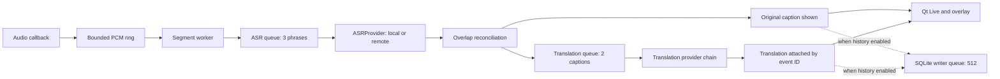

# Architecture

SubbyAI is a single-process PySide6 desktop app. The controller wires capture, processing,
storage and UI together. Audio, ASR, translation and storage are framework-free; Qt signals
carry immutable caption events from the pipeline to the UI. Each layer has a narrow contract and bounded work queues.

## Contracts

**Original captions never wait for translation.** A caption has a stable event ID, original
text and independent translation state. Later translation updates the same displayed and
persisted event. A slow or failed translator preserves the original. SQLite upserts and FTS
updates keep searchable history consistent without duplicating rows.

**Real-time work stays bounded.** The ring counts overwritten samples. ASR and translation
queues discard older pending work when full to stay near current playback. Metrics expose
queue depth, dropped work, wait time, ASR duration, translation duration and audio-end-to-caption
latency. Overload can omit speech; it cannot accumulate an unlimited backlog. The history
writer separately counts rejected writes when its bounded queue is full.

**Stop is a request, completion is an event.** The GUI never joins native inference workers.
The run owner joins them off the GUI thread, closes remote clients, then emits `stopped`.
A new run is refused while any old worker is alive, including after failure. Post-stop results
are suppressed. Device switching waits for completion before reconnecting. A hung native
library cannot safely be killed from Python; shutdown continues waiting while the UI stays responsive.

**Each run receives frozen settings.** `SessionConfig` snapshots processing and provider
configuration. A Simple/Advanced toggle changes visibility, not engine state. Only an explicit
profile choice rewrites its underlying model, precision and phrase settings.

## Audio and subtitles

Capture callbacks convert/downmix and write the ring. Consumer workers resample and segment
20 ms frames. The current detector is an adaptive energy gate, not neural Silero VAD. Phrase
completion uses silence and maximum duration, retains preroll/overlap, and publishes real audio
start/duration metadata. Ring discontinuities reset the segmenter so unrelated audio isn't joined.

Whisper and Parakeet provide phrase-final results. This is not token streaming; partial text
isn't repeatedly painted. `pipeline/reconciliation.py` trims duplicate prefixes only for
windows that overlap in time, including CJK text, while preserving later deliberate repetition.
Hallucination filtering uses available recognition confidence; remote services without confidence
are treated as unknown rather than given fabricated scores.

Overlay wrapping limits lines per language and ellipsizes the final line. Its stable card width,
minimum dwell and caption history control readability. The overlay stores display preference and
geometry in logical coordinates; display removal restores an accessible placement.

## Modules and extension points

| Area | Responsibility |
|---|---|
| `core/settings.py`, `profiles.py` | Validated schema 4 settings, migrations, atomic saves, profile mappings |
| `core/network.py`, `logging_setup.py` | Endpoint validation, bounded replies, safe log formatting |
| `audio/` | Capture interface, OS backends, ring, segmentation, meter-only setup preview |
| `asr/base.py`, `engine.py`, `parakeet.py`, `remote.py` | Small ASRProvider contract and concrete engines |
| `asr/models.py`, `capability.py` | Curated revisions, downloads, cache integrity, isolated hardware probes |
| `translation/` | Provider chain, compatible text APIs, local CTranslate2 and validated packs |
| `pipeline/` | Run ownership, stage queues, timing, reconciliation and failure policy |
| `storage/` | Batched SQLite/FTS5 writer, retention, export and translation updates |
| `ui/` | Theme tokens, original Qt mascot, shell, Simple/Advanced settings, overlay and setup |
| `app.py`, `system/` | Cross-layer policy, tray, shortcuts, device recovery and single instance |

`ASRProvider` exposes load, transcribe and close with the existing result shape. The controller
chooses an engine; the GUI doesn't implement recognition. Translation has a separate provider
contract and an ordered chain with three-failure/60-second circuit breaking. See [providers.md](providers.md).

Local model cache keys include model, device, precision and CPU threads. One speech engine remains
warm across compatible runs; beam size is set per run. Local translation caches at most three
loaded pairs. At most two missing-pair installations run simultaneously, with a failure cooldown.
The lightweight pack manager removes Argos Python's unused PyTorch/Stanza dependency tree while
retaining its installed model format and direct CTranslate2/SentencePiece inference.

## Measurement and validation

Use real media and the live scalar diagnostics to assess latency on target hardware.
Physical Bluetooth, mixed-DPI, GPU and long-session checks complement automated tests.
